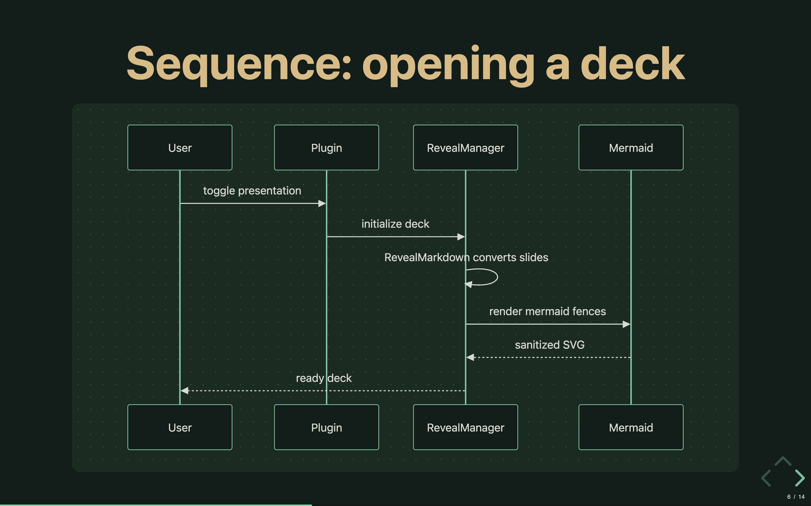

# ink-presentation

Present your Markdown notes as beautiful [Reveal.js](https://revealjs.com) slideshows inside [Inkdrop](https://www.inkdrop.app/) v6 — no external tools, no leaving the app.



- 🎨 **App-native theme by default** — slides follow your Inkdrop theme (light/dark, colors, fonts) live, plus 6 classic Reveal themes
- ✂️ **Flexible slide splitting** — `---` breaks, or automatic `#`/`##` heading splitting with vertical stacks
- 🧮 **Diagrams & math** — Mermaid diagrams and KaTeX math (`$…$` / `$$…$$`), both loaded lazily only when a note uses them
- 🗒️ **Speaker notes** — `<!-- note: ... -->` comments or `Note:` lines, shown in an in-deck overlay
- 🪞 **Speaker view** — press <kbd>V</kbd> for a separate synced window with current + next slide, notes, slide counter, and a timer
- 🔄 **Live refresh** — edits to the note from another window (or synced from another device) rebuild the open deck in place, keeping your slide position
- 🧱 **Code-fence aware** — `---`, `#`, and `Note:` inside code blocks never break your slides
- ⚙️ **Per-note config** — override theme, transition, splitting, and even deck CSS via YAML frontmatter
- 🔒 **Fully isolated** — the deck renders in a Shadow DOM; plugin styles never leak into the app

## Install

In Inkdrop, open **Preferences ▸ Plugins**, search for `ink-presentation`,
and install — or from a terminal:

```bash
ipm install ink-presentation
```

<details>
<summary>Install from source instead</summary>

```bash
git clone https://github.com/crafts69guy/ink-presentation.git
cd ink-presentation
pnpm install && pnpm build
ln -sfn "$PWD" ~/Library/Application\ Support/inkdrop/packages/ink-presentation
```

> **Inkdrop v6 canary:** the canary build keeps its data in `inkdrop-canary`
> instead of `inkdrop` — link into
> `~/Library/Application Support/inkdrop-canary/packages/ink-presentation`.

</details>

## Usage

Open a note, then press <kbd>Ctrl</kbd>+<kbd>Alt</kbd>+<kbd>P</kbd> or select **Plugins ▸ Toggle Presentation**.

New to the plugin? Run **Plugins ▸ Present Sample Deck** (or the
`ink-presentation:present-sample` command) to present a bundled demo note
that showcases every feature below — no note of your own required. Disable
it via the "Show 'Present Sample Deck' command" setting if you don't want
it in the command palette.

### Keys while presenting

| Key                                                                                                           | Action                                                                |
| ------------------------------------------------------------------------------------------------------------- | --------------------------------------------------------------------- |
| <kbd>→</kbd> / <kbd>↓</kbd> / <kbd>Space</kbd> / <kbd>PgDn</kbd> / <kbd>N</kbd> / <kbd>J</kbd> / <kbd>L</kbd> | Next slide                                                            |
| <kbd>←</kbd> / <kbd>↑</kbd> / <kbd>PgUp</kbd> / <kbd>P</kbd> / <kbd>H</kbd> / <kbd>K</kbd>                    | Previous slide                                                        |
| <kbd>Home</kbd> / <kbd>End</kbd>                                                                              | First / last slide                                                    |
| <kbd>O</kbd>                                                                                                  | Overview grid                                                         |
| <kbd>S</kbd>                                                                                                  | Toggle speaker notes                                                  |
| <kbd>V</kbd>                                                                                                  | Open the speaker view window (current + next slide, notes, timer)     |
| <kbd>F</kbd>                                                                                                  | Toggle fullscreen                                                     |
| <kbd>B</kbd> / <kbd>.</kbd>                                                                                   | Pause (black screen)                                                  |
| <kbd>Esc</kbd>                                                                                                | Close overview grid, or close the presentation (exits fullscreen too) |

### Writing slides

See **[docs/writing-slides.md](docs/writing-slides.md)** for the full guide. Quick example:

````markdown
---
theme: inkdrop
transition: fade
---

# My Talk

Intro slide

---

## Code

```js
const answer = 42
```

<!-- note: mention the benchmark here -->
````

## Settings

**Preferences ▸ Plugins ▸ ink-presentation**

| Setting                                | Default   | Description                                                                                                                             |
| -------------------------------------- | --------- | --------------------------------------------------------------------------------------------------------------------------------------- |
| Slide separator                        | `auto`    | `auto` picks per note (`---` if present, else headings); `hr` splits on `---`; `h1`/`h2` split on headings (`h2` stacks H2s vertically) |
| Theme                                  | `inkdrop` | `inkdrop` follows the app theme; also black, white, league, night, serif, simple                                                        |
| Slide transition                       | `slide`   | none / fade / slide / convex / concave / zoom                                                                                           |
| Enter fullscreen automatically         | on        |                                                                                                                                         |
| Show slide number                      | on        |                                                                                                                                         |
| Show progress bar                      | on        |                                                                                                                                         |
| Vertical slides                        | off       | Enables `--` as a vertical separator in `hr` mode                                                                                       |
| Auto-refresh the deck while presenting | on        | Rebuild the open deck (keeping position) when the note changes in another window or via sync                                            |
| Show "Present Sample Deck" command     | on        | Adds a command/menu entry to present a bundled sample note showcasing the plugin's features                                             |

Frontmatter keys (`theme`, `transition`, `separator`, `slideNumber`, `progress`, `verticalSlides`, `css`) override these per note. `css` takes a block of deck-scoped CSS injected after the theme (see [docs/writing-slides.md](docs/writing-slides.md#custom-css)).

## Known limitations

- **Mermaid diagrams** render as SVG; malformed diagrams show an inline error instead of blocking the deck
- **Math** delimiters follow remark-math rules — `$` must hug the expression (so `$5 and $10` stays prose), `\$` escapes a literal dollar, and math is not detected inside code or 4-space-indented lines. Invalid TeX renders as red source text
- **Speaker view** rides on undocumented Inkdrop internals (the app's own `create-simple-window` and `broadcast-command` IPC, discovered in v6 canary.21) — if a future Inkdrop build changes them, <kbd>V</kbd> shows an error notification instead of a window
- Webfonts referenced by Reveal's built-in themes (League Gothic, Source Sans Pro) fall back to system fonts — fonts can't load inside a shadow root

## Development

```bash
pnpm install
pnpm build        # generate CSS modules + bundle to lib/
pnpm dev          # watch mode
pnpm test         # unit tests (vitest)
pnpm typecheck && pnpm lint
```

Link into Inkdrop for development (note the canary data-dir caveat — `ipm link --dev` targets the stable `inkdrop` dir only):

```bash
ln -sfn "$PWD" ~/Library/Application\ Support/inkdrop-canary/dev/packages/ink-presentation
```

Enable **Development Mode** in Preferences ▸ General and reload (<kbd>⌥⌘⇧R</kbd>).

Docs for contributors:

- **[docs/architecture.md](docs/architecture.md)** — how it works and why.
- **[docs/verifying.md](docs/verifying.md)** — the in-app checklist for
  things the test suite can't cover (run before releasing).
- **[docs/canary-upgrade.md](docs/canary-upgrade.md)** — the undocumented
  Inkdrop internals the plugin rides on, and how to re-verify them after an
  Inkdrop upgrade.

## Publishing

Published to the Inkdrop plugin registry. Releases are cut with
`ipm publish` (validate first with `ipm publish --dry-run`); the version and
git tag are managed in the repo (see `docs/verifying.md` for the pre-release
in-app checklist).

## Planned features

Everything from the roadmap has shipped:

- [x] KaTeX math rendering in slides
- [x] Popup speaker view
- [x] Custom per-note CSS via frontmatter
- [x] Auto-refresh the deck while editing, mid-presentation
- [x] Plugin-registry publication

PDF/HTML export is intentionally out of scope — Inkdrop's built-in note export already covers it.

## License

[MIT](LICENSE)
